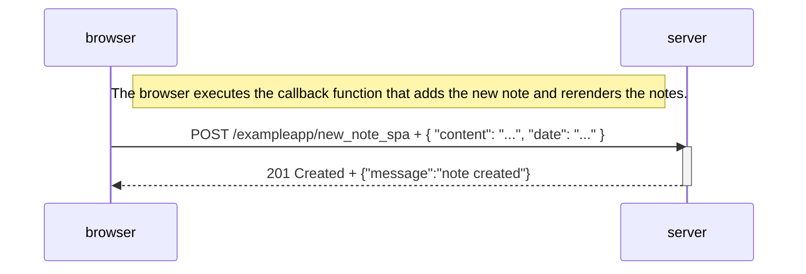

```mermaid
sequenceDiagram
    participant browser
    participant server

    Note right of browser: The browser executes the callback function that adds the new note and rerenders the notes.

    browser->>server: POST /exampleapp/new_note_spa + { "content": "...", "date": "..." }
    activate server
    server-->>browser: 201 Created + {"message":"note created"}
    deactivate server
```
